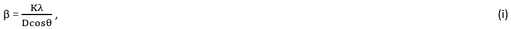
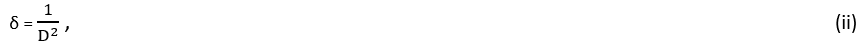
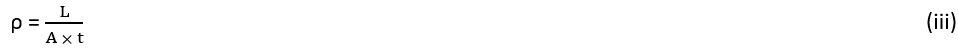
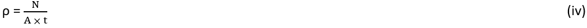

<b>Dislocation density</b> (typically given in m/m³ or m⁻²) : Dislocations are defects within the crystal structure that significantly influence mechanical properties. Dislocation density is the measure of the total length of dislocation lines per unit volume of a material. 
Cold rolling is a process that changes the properties of metals by deforming them at room temperature. During cold rolling, the metal is compressed and elongated, which increases the number of dislocations in the material's crystal structure. This higher dislocation density makes the metal stronger and harder, a phenomenon known as work hardening, because the dislocations interfere with each other and resist further movement. The grains in the metal also become elongated and develop a preferred orientation, which affects the material's behaviour.  

<b>Utility</b> : Determining dislocation density in a material is essential for understanding and improving its mechanical properties. Dislocations are defects in the crystal structure that affect how materials deform and strengthen. Higher dislocation densities generally result in stronger and harder materials due to dislocation interactions that hinder further movement. In materials science, dislocation density is used to quantify the extent of plastic deformation and is often correlated with properties such as yield strength, hardness and ability to resist deformation. This information helps us understand how materials harden when worked, predict how they will behave under stress, and design processes to enhance their properties. High dislocation densities can improve resistance to cracking and deformation at high temperatures. By controlling dislocation density through processing methods, we can tailor materials for specific applications, improving their performance and extending their lifespan. Overall, studying dislocation density is crucial for developing and optimizing materials processing and properties. It can be measured using various experiments like XRD and TEM.  

X-ray diffraction (XRD) is a technique used to study the arrangement of atoms in crystalline materials. When an X-ray beam hits a crystal, the atoms cause the beam to diffract at specific angles, producing a pattern of peaks. The positions of these peaks tell us about the spacing between planes of atoms (lattice parameters), while the shapes and widths of the peaks can reveal imperfections like dislocations. In cold-rolled metals, large numbers of dislocations are introduced due to the severe deformation. These dislocations slightly distort the crystal lattice, leading to peak broadening in the XRD pattern. 

To estimate the dislocation density using XRD, researchers often measure the broadening of the diffraction peaks and apply mathematical models (for example, Scherrer equation or other line broadening methods). The idea is that the smaller the crystallites (coherently scattering domains), the broader the XRD peaks. By comparing the measured broadening to well-established equations, we can calculate an approximate number of dislocations per unit volume—known as the dislocation density.
According to Scherrer’s formula for peak broadening β, 

 
where D = crystallite size, λ = wavelength of X-ray, θ = Bragg’s diffraction angle, K = dimensionless shape factor ≈ 0.9  
And then dislocation density δ can be estimated using the derived value in the equation:  

  

Transmission Electron Microscopy (TEM) is another powerful tool for observing the internal structure of materials at very high magnifications. In TEM, a thin sample is penetrated by an electron beam, and the electrons that pass through are collected to form an image. Dislocations appear as dark or extra lines in the micrograph, because they change the path or intensity of the electrons that pass through. By carefully preparing the sample so it is thin enough for electron transmission, one can directly visualize and count dislocations. 

To estimate dislocation density from a TEM image, one common approach is to measure the length of dislocation lines in a known area and then convert this to the number of dislocations per volume. For instance, you can count the total length of visible dislocations in a micrograph, divide by the sample thickness, and then normalize by the area of the image. So, 

•	If measuring total line length, equation is : 
 

where L = total length of dislocation lines, A = area of the observed region, t = thickness of foil sample, and ρ = dislocation density (m⁻²)  

•	If counting discrete lines, use : 
 
where N = no. of discrete dislocation segments  

This provides a straightforward but direct measure of how many dislocations exist in the metal, which can be compared to the estimates made from XRD peak broadening for a more comprehensive understanding of the cold-rolled material’s defect structure.

